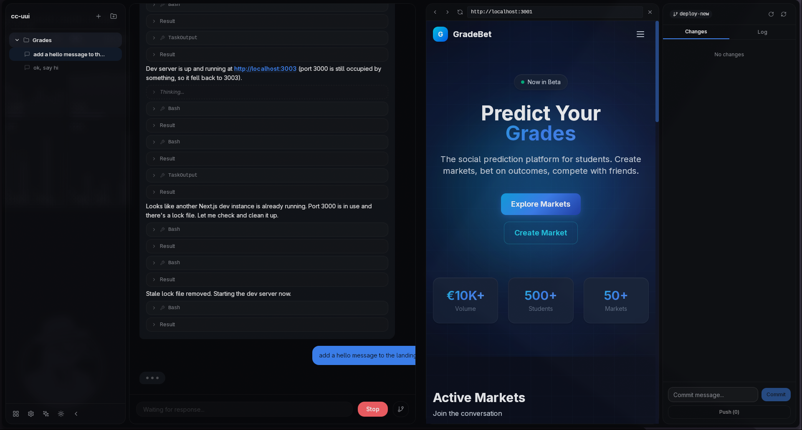

<div align="center">
  

  # cc-ui

  A desktop interface for Claude AI. Chat, code, commit, and deploy — all in one window.

  [Download](#getting-started) · [Features](#features) · [Development](#development)

</div>

---

## What is this?

cc-ui is a native desktop app that puts Claude AI directly into your development workflow. Instead of switching between a browser tab and your editor, you get a persistent AI assistant with full context about your projects — right on your desktop.

Built with [Electrobun](https://electrobun.dev/), React 19, and Tailwind CSS.

## Features

- **AI Chat** — Real-time conversations with Claude, streaming responses, and full message history per project
- **Multi-Project Support** — Organize sessions by project, each with its own context and conversation history
- **Built-in Git** — Stage, diff, commit, and push without leaving the app. Visual diffs with color-coded changes
- **Skills System** — Extend functionality with slash commands. Install community skills or create your own
- **Mobile Access** — Scan a QR code to continue conversations from your phone with real-time sync
- **Browser Panel** — Auto-detected dev servers open in a built-in browser panel alongside your chat
- **Dark & Light Mode** — System-aware theme with smooth switching
- **Local First** — Your code and API key never leave your machine. No telemetry, no accounts

## Getting Started

### Prerequisites

- [Bun](https://bun.sh/) runtime
- An [Anthropic API key](https://console.anthropic.com/)

### Install & Run

```bash
git clone https://github.com/Nefnief-tech/Claude-code-ui.git
cd Claude-code-ui
bun install
bun run start
```

On first launch, you'll be prompted to enter your API key. That's it.

## Development

```bash
bun install
bun run start        # Build and launch
bun run dev          # Watch mode — rebuilds on file changes
bun run dev:hmr      # HMR via Vite dev server
bun run lint         # Lint with Biome
bun run lint:fix     # Auto-fix lint issues
```

## Project Structure

```
src/
  bun/              # Main process (Bun runtime)
    index.ts        # App entry, window creation, RPC handlers
    agent.ts        # Claude agent / chat logic
    git.ts          # Git operations
    skills.ts       # Skills management
    mobile-server.ts # Mobile access server
  mainview/         # Webview UI (React + Vite)
    components/     # UI components
      ui/           # shadcn/ui primitives
    lib/            # Hooks, utilities, RPC client
  shared/
    rpc.ts          # Type-safe RPC schema
landing/            # Landing page
```

## Tech Stack

| Layer | Tech |
|---|---|
| Desktop Runtime | [Electrobun](https://electrobun.dev/) |
| Frontend | React 19, TypeScript |
| Styling | Tailwind CSS 4, shadcn/ui |
| Build | Vite 6 |
| Backend | Bun |
| Linting | Biome |

## License

MIT
